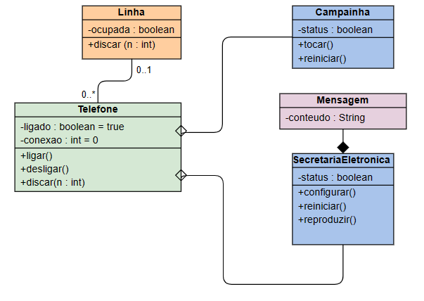

# Exercicio de Tópicos de computação 2 - Exercicio de Angular 2

### Grupo: Amadeu Jose Andrade Junior (SC301181X), Guilherme Garcia Mancuso (SC3008533), João Pedro Volante (SC303304X) e Renato Porto Morillo (SC3014762).
- Você e o seu grupo foram convidados para realizar parte do desenvolvimento de um sistema WEB na área de telefonia . Assim, tendo como base a criação de componentes utilizando Angular, pede-se realizar a implementação do modelo abaixo utilizando TypeScript por meio de componentes Angular.
- Ao final, espera-se visualizar na camada front-end  uma simulação com dados fictícios.

#### Diagrama de Classe:

